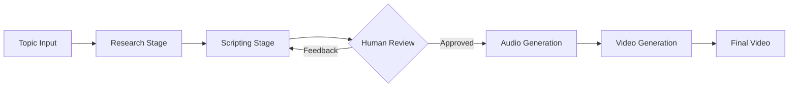

# 🎬 AI Video Content Agent

An AI system that turns your idea into a ready-to-post viral short video. You give a topic, and the system automatically finds trending content across platforms, writes an engaging script (with a chance for you to review and edit it), generates a natural human-like voiceover, and produces a polished short-form video—all with minimal effort from you.

## 📺 Demo

> **To display the demo video:** Upload `result.mp4` to GitHub and replace the placeholder URL below
> demo vid try

https://github.com/user-attachments/assets/your-video-id-here

**How to upload `result.mp4`:**
1. Go to any GitHub issue or pull request in your repository
2. Drag and drop `result.mp4` from the root directory into the comment box
3. GitHub will upload it and generate a URL like: `https://github.com/user-attachments/assets/...`
4. Copy that URL and replace `your-video-id-here` above
5. Alternatively, use [GitHub Releases](https://docs.github.com/en/repositories/releasing-projects-on-github/managing-releases-in-a-repository) for larger files

## ✨ Features

- 🔍 **Multi-Platform Research**: Automatically discovers trending content from YouTube Shorts, Twitter/X, and fresh news via Exa
- 📝 **AI-Powered Scriptwriting**: Generates viral-optimized scripts using GPT-4o with strict style guidelines
- 👤 **Human Review Loop**: Interactive approval system for script refinement with feedback integration
- 🎙️ **Professional Voiceover**: High-quality text-to-speech using ElevenLabs with multilingual support
- 🎥 **Automated Video Production**: Creates polished vertical videos (9:16) using HeyGen avatars
- 🔄 **End-to-End Automation**: Seamless pipeline from topic input to final video delivery

## 🏗️ Architecture

The system operates through four sequential stages:




## 🚀 Getting Started

### Prerequisites

- **Node.js** 18+ and npm
- **Composio Account** ([Sign up here](https://platform.composio.dev))
- **API Keys** for:
  - OpenAI (GPT-4o)
  - ElevenLabs
  - HeyGen
  - Exa
  
### Installation

1. **Clone the repository**
   ```bash
   git clone https://github.com/yourusername/video-content-agent.git
   cd video-content-agent
   ```

2. **Install dependencies**
   ```bash
   npm install
   ```
3. **Authenticate services via Composio**
   
   You'll need to connect each service through Composio's authentication flow:
   - Log in to [Composio Dashboard](https://platform.composio.dev)
   - Create a new project.
   - Go to settings for COMPOSIO_API_KEY
   - Navigate to "Auth configs".
   - Connect: YouTube, Twitter, Exa, ElevenLabs, and HeyGen(self explanatory).
   - Take auth config ids from the dashboard and paste it in the .env file.


4. **Set up environment variables**
   
   Create a `.env` file in the root directory:
   ```env
   # OpenAI
   OPENAI_API_KEY=your_openai_api_key
   
   # Composio
   COMPOSIO_API_KEY=your_composio_api_key
   COMPOSIO_USER_ID=your_user_id
   
   # Auth Config IDs (from Composio dashboard)
   YOUTUBE_AUTH_CONFIG_ID=your_youtube_config_id
   TWITTER_AUTH_CONFIG_ID=your_twitter_config_id
   EXA_AUTH_CONFIG_ID=your_exa_config_id
   ELEVENLABS_AUTH_CONFIG_ID=your_elevenlabs_config_id
   HEYGEN_AUTH_CONFIG_ID=your_heygen_config_id
   ```


5. **Build the project**
   ```bash
   npm run build
   ```

### Usage

Run the agent:
```bash
npm start
```

You'll be prompted to enter a topic:
```
? What topic would you like to generate video content for? › voice agents in 2025
```

The agent will then:
1. Research the topic across platforms (~30-60 seconds)
2. Generate a script and request your approval
3. Generate audio from the approved script (~10-20 seconds)
4. Create the final video (~2-5 minutes depending on HeyGen queue)


## 📁 Project Structure

```
video-content-agent/
├── src/
│   ├── agents/
│   │   ├── research.ts          # Multi-platform content discovery
│   │   ├── scripting.ts         # AI script generation
│   │   ├── human_review.ts      # Interactive approval system
│   │   ├── audio.ts             # ElevenLabs voice synthesis
│   │   └── video_generation.ts  # HeyGen video production
│   ├── services/
│   │   └── client.ts            # Composio toolkit sessions
│   └── state/
│       └── state.ts             # TypeScript type definitions
├── index.ts                      # Main pipeline orchestrator
├── package.json
├── tsconfig.json
└── .env                          # Environment variables (not committed)
```


## 🔧 Configuration

### Customizing Voice Settings

Edit `src/agents/audio.ts`:
```typescript
// Change voice ID (find IDs in ElevenLabs dashboard)
const VOICE_ID = "EIsgvJT3rwoPvRFG6c4n"; // Default: Clara

// Change model
const MODEL_ID = "eleven_multilingual_v2";
```

### Customizing Avatar

Edit `src/agents/video_generation.ts`:
```typescript
// Change avatar ID (find IDs in HeyGen dashboard)
const AVATAR_ID = "109cdee34a164003b0e847ffce93828e"; // Default: Jasmine

// Change video dimensions
const dimension = { width: 720, height: 1280 }; // 9:16 vertical
```

### Script Style Guidelines

Modify `src/agents/scripting.ts` to adjust:
- Script length (default: 75-85 words)
- Tone and reading level
- Banned words/phrases
- Structural requirements

## 🐛 Troubleshooting

### Authentication Errors

If you see authentication links in the output:
```
🚨 AUTHENTICATION REQUIRED: Please click here to authenticate...
```
1. Click the provided link
2. Complete the OAuth flow
3. Restart the agent with `npm start`

### Video Generation Fails

- Ensure audio URL is publicly accessible (not localhost)
- Check HeyGen account quota/credits
- Verify avatar ID exists in your HeyGen account

### Script Quality Issues

- Provide detailed feedback during human review
- Adjust style guidelines in `scripting.ts`
- Ensure research data is comprehensive (check API quotas)

## 📝 Development

### Running in Development Mode

Use `tsx` for faster iteration without building:
```bash
npx tsx index.ts
```

### Adding New Research Sources

1. Create a new toolkit session in `research.ts`
2. Define an agent with specific instructions
3. Parse and integrate results into `ResearchData`

### Extending the Pipeline

Add new stages by:
1. Creating a new agent file in `src/agents/`
2. Importing and calling it in `index.ts`
3. Updating `AgentState` type in `src/state/state.ts`

## 🤝 Contributing

Contributions are welcome! Please follow these steps:

1. Fork the repository
2. Create a feature branch (`git checkout -b feature/amazing-feature`)
3. Commit your changes (`git commit -m 'Add amazing feature'`)
4. Push to the branch (`git push origin feature/amazing-feature`)
5. Open a Pull Request

## 📄 License

This project is licensed under the MIT License - see the [LICENSE](LICENSE) file for details.

## 🙏 Acknowledgments


- [Composio](https://composio.dev) for seamless API integrations
- [OpenAI](https://openai.com) for GPT-4o and the Agents SDK
- [ElevenLabs](https://elevenlabs.io) for high-quality voice synthesis
- [HeyGen](https://heygen.com) for AI avatar technology

## 📧 Contact

For questions or support, please open an issue or reach out to [your-email@example.com](mailto:your-email@example.com).

---
[](https://opensource.org/licenses/MIT)

**Built with ❤️ using AI agents**
